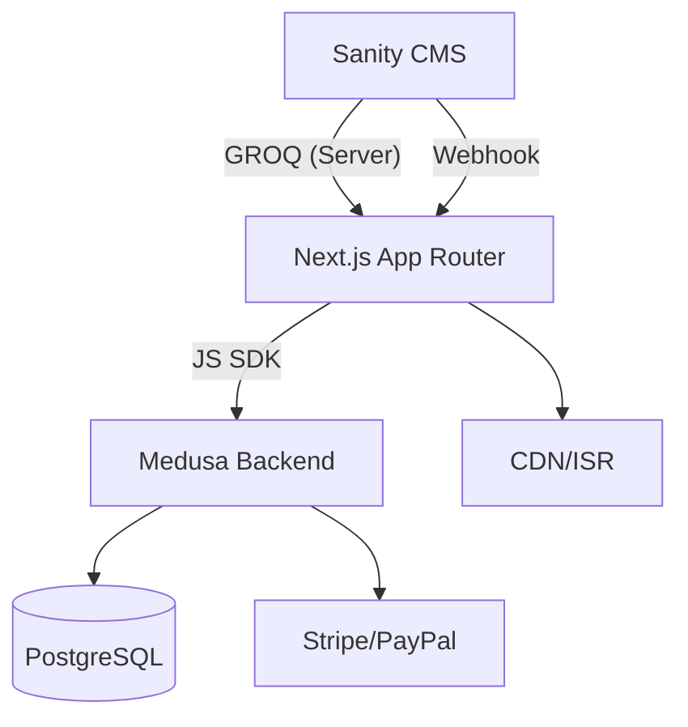

# 架构文档（Medusa + Sanity + Next.js + Tailwind）

> 后端：`backend`（Medusa v2）；前端：`front`（Next.js App Router + Tailwind）。内容：Sanity。UI 使用英文。

## 1. 仓库结构与关键位置
- 后端（Medusa）：`backend`
  - 配置：`backend/medusa-config.ts`
  - 扩展：`backend/src/modules`、`backend/src/api`、`backend/src/subscribers`、`backend/src/workflows`
  - 脚本：`backend/src/scripts/seed.ts`
- 前端（Next.js）：`front`
  - 路由根：`front/src/app/[countryCode]`
  - SDK：`front/src/lib/config.ts`
  - 数据：`front/src/lib/data/*`
  - 组件与模板：`front/src/modules/*`

## 2. 高层与端到端流程
- 前端服务端（RSC/Route Handler）直读 Sanity（GROQ），并通过 Medusa JS SDK 访问电商域；页面使用 ISR；Sanity 发布触发 Webhook → `/api/revalidate` 失效缓存。
- 端到端示意：

## 3. 模块与 API 规划（后端）
- 模块：`backend/src/modules/tea`（内容域可选缓存/查询层）
  - 模型：`Origin`、`BrewingGuide`
  - Service：`TeaModuleService`（只读查询 + 可选同步）
- Store API（只读）：
  - `GET /store/tea/origins`、`GET /store/tea/origins/:id`
  - `GET /store/tea/guides`、`GET /store/tea/guides/:id`、`GET /store/tea/guides/by-type/:teaType`
- Admin API（读写）：
  - `POST/PUT/DELETE /admin/tea/origins`、`/admin/tea/guides`（若采用后端摄取/缓存模式）

## 4. 数据策略
- 商品权威：Medusa `Product/Variant`；茶叶属性放在 `product.metadata.*`。
- 内容权威：Sanity；前端直读，后端仅作为可选缓存层（需要统一分页/筛选时）。
- 关联策略：`product.metadata.origin_id` ↔ Sanity `Origin.slug`；`product.metadata.tea_type` ↔ `BrewingGuide.tea_type`。

## 5. Tailwind 设计系统
- 在 `front/tailwind.config.js` 扩展主题：
  - 颜色令牌：`brand.primary`、`brand.accent`、`surface`、`ink`、`muted`；
  - 字号与行高刻度、间距尺度、圆角与阴影；
  - 暗色模式（class）。
- 组件库分层：基础（按钮/输入/卡片）→ 复合（ProductCard/OriginCard/GuideSteps）→ 模板（首页、列表、详情）。

## 6. 缓存与再验证
- 前端：RSC 层数据缓存 + ISR；页面维度设置 10–60 分钟；
- Webhook：Sanity 发布/下线 → 触发 `/api/revalidate`（签名校验）→ 精准失效对应路径；
- 后端：如启用缓存层，设置短时只读缓存（30–120s），并在 Webhook 时同步失效。

## 7. 环境变量（Sanity 已选）
- 前端：
  - `MEDUSA_BACKEND_URL`
  - `NEXT_PUBLIC_MEDUSA_PUBLISHABLE_KEY`
  - `SANITY_PROJECT_ID`、`SANITY_DATASET`、`SANITY_API_READ_TOKEN`、`SANITY_STUDIO_URL`
- 后端：
  - `DATABASE_URL`、`MEDUSA_*`、`STRIPE_*`/`PAYPAL_*`

## 8. 安全与权限
- Sanity Token 仅服务器端；再验证路由签名校验与来源白名单；
- CORS 白名单（后端）；支付由网关托管；日志脱敏；最小权限原则。
