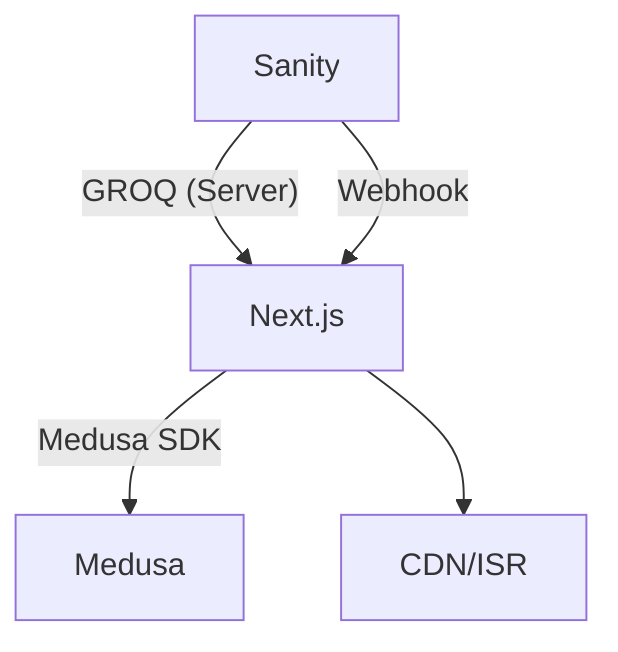

# Sanity 集成方案（已选）

> 目标：为“产地（Origins）/ 冲泡指南（Brewing Guides）”等内容提供优质编辑体验；电商域继续由 Medusa 承载。UI 使用英文，文档为中文。

## 1. 为什么选择 Sanity
- 实时协作与版本：多人编辑、历史回溯、评论；
- Studio 与 Schema：组件化富文本、强 Schema 校验、定制灵活；
- GROQ 查询：前端高效聚合读取；
- 预览与发布：Draft/Publish 流程顺畅，Webhook 与 ISR 配合优秀；
- 托管与稳定：免自运维，关注业务本身。

## 2. 内容模型（本项目）
- Origin
  - `title`、`slug`、`country`（ISO-3166 alpha-2）、`region`、`mountain`、`coordinates`、`climate`、`soil`、`flavor_profile[]`、`hero_image`、`gallery[]`、`seo.*`、`related_products[]`（Medusa 商品 handle）。
- BrewingGuide
  - `tea_type`、`vessel`、`water_temp_c`、`leaf_gram_per_100ml`、`time_plan[]`、`brew_times`、`tips`、`content_blocks[]`、`images[]`、`seo.*`、`recommended_products[]`。
- 关联策略
  - `product.metadata.origin_id` ↔ `origin.slug`；`product.metadata.tea_type` ↔ `guide.tea_type`。

## 3. 集成架构
- 前端服务器（RSC/Route Handler）通过 `SANITY_API_READ_TOKEN` 读取 Draft/Published 数据；
- 页面使用 ISR；Sanity 发布触发 Webhook 调用 `/api/revalidate` 精准失效；


## 4. 安全与缓存
- Token：仅服务端环境变量；最小权限；定期轮换；
- Webhook：签名校验与来源白名单、速率限制；
- ISR：`origins/*`、`guides/*` 10–60 分钟；发布后精准失效；

## 5. 实施步骤
1) 创建 Sanity 项目/数据集；
2) 定义 `Origin`/`BrewingGuide` Schema 与 Studio；
3) 配置环境变量：`SANITY_PROJECT_ID`、`SANITY_DATASET`、`SANITY_API_READ_TOKEN`、`SANITY_STUDIO_URL`；
4) 在 Next.js 服务器端实现 GROQ 查询与 DTO 映射；
5) 配置 Webhook → `/api/revalidate`（签名）；
6) 商品页整合 Quick Brew 回落逻辑。

## 6. GROQ 查询示例
```groq
*[_type == "origin" && slug.current == $slug][0]{
  title, country, region, mountain, flavor_profile, hero_image,
  "products": related_products[]->{"handle": medusa_handle}
}
```

## 7. 环境变量
- `SANITY_PROJECT_ID`、`SANITY_DATASET`、`SANITY_API_READ_TOKEN`、`SANITY_STUDIO_URL`

## 8. 预览与再验证
- 预览：`/api/preview`，仅 Editor 可开启，读取 Draft；
- 再验证：`/api/revalidate` 按类型与 slug 精准失效（例如 `/origins/[slug]`、`/guides/[slug]`）。
