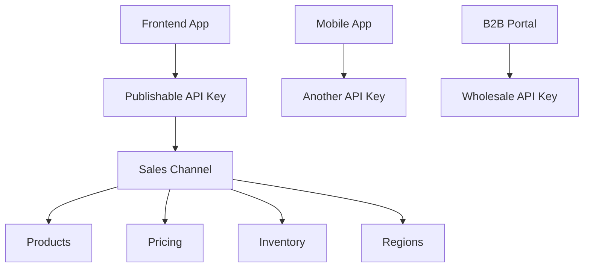

# Medusa v2 多 API Key 管理指南

## 📋 目录

- [概述](#概述)
- [架构设计](#架构设计)
- [使用场景](#使用场景)
- [创建和管理](#创建和管理)
- [前端集成](#前端集成)
- [最佳实践](#最佳实践)
- [故障排除](#故障排除)
- [示例代码](#示例代码)

## 概述

Medusa v2 支持创建多个 Publishable API Key，每个 key 可以关联不同的销售渠道，实现灵活的多店铺、多品牌、多地区架构。

### 核心概念



## 架构设计

### 基础架构模式

```typescript
interface ApiKeyArchitecture {
  apiKey: string // Publishable API Key
  salesChannel: string // 关联的销售渠道
  products: Product[] // 可访问的产品
  regions: Region[] // 支持的地区
  pricing: PricingTier // 价格层级
  features: Feature[] // 功能权限
}
```

### 多层级设计

1. **API Key** → 身份认证层
2. **Sales Channel** → 业务逻辑层
3. **Products/Regions** → 数据访问层
4. **Pricing/Inventory** → 业务规则层

## 使用场景

### 1. 多品牌商店

```typescript
// 茶叶商店示例
const brandConfig = {
  zentee: {
    name: "Zentee - 禅茶",
    apiKey: "pk_zentee_xxx",
    salesChannel: "zentee-store",
    products: ["green-tea", "oolong-tea", "white-tea"],
    theme: "zen-minimal",
    pricing: "premium",
  },
  everyday: {
    name: "Everyday Tea - 日常茶饮",
    apiKey: "pk_everyday_xxx",
    salesChannel: "everyday-store",
    products: ["black-tea", "herbal-tea", "tea-bags"],
    theme: "casual-colorful",
    pricing: "affordable",
  },
}
```

### 2. 客户类型分离

```typescript
// B2C vs B2B
const customerSegments = {
  retail: {
    apiKey: "pk_retail_xxx",
    salesChannel: "consumer-channel",
    minOrderQty: 1,
    pricing: "retail",
    features: ["wishlist", "reviews", "loyalty"],
  },
  wholesale: {
    apiKey: "pk_wholesale_xxx",
    salesChannel: "b2b-channel",
    minOrderQty: 100,
    pricing: "wholesale",
    features: ["bulk-pricing", "credit-terms", "rep-contact"],
  },
  distributor: {
    apiKey: "pk_distributor_xxx",
    salesChannel: "distributor-channel",
    minOrderQty: 1000,
    pricing: "distributor",
    features: ["territory-management", "marketing-materials"],
  },
}
```

### 3. 地理区域分离

```typescript
// 不同地区不同配置
const regionalStores = {
  northAmerica: {
    apiKey: "pk_na_xxx",
    salesChannel: "na-channel",
    currency: "USD",
    language: "en",
    shippingOptions: ["usps", "fedex", "ups"],
    paymentMethods: ["stripe", "paypal", "apple-pay"],
  },
  europe: {
    apiKey: "pk_eu_xxx",
    salesChannel: "eu-channel",
    currency: "EUR",
    language: "en",
    shippingOptions: ["dhl", "eu-post"],
    paymentMethods: ["stripe", "klarna", "sepa"],
  },
  asia: {
    apiKey: "pk_asia_xxx",
    salesChannel: "asia-channel",
    currency: "USD",
    language: ["en", "zh", "ja"],
    shippingOptions: ["local-courier", "ems"],
    paymentMethods: ["stripe", "alipay", "wechat-pay"],
  },
}
```

### 4. 平台类型分离

```typescript
// 不同平台不同体验
const platformChannels = {
  website: {
    apiKey: "pk_web_xxx",
    salesChannel: "website-channel",
    features: ["full-catalog", "detailed-product-info", "reviews"],
    ui: "desktop-optimized",
  },
  mobileApp: {
    apiKey: "pk_mobile_xxx",
    salesChannel: "mobile-channel",
    features: ["quick-reorder", "location-services", "push-notifications"],
    ui: "mobile-optimized",
  },
  marketplace: {
    apiKey: "pk_marketplace_xxx",
    salesChannel: "marketplace-channel",
    features: ["simplified-catalog", "marketplace-integration"],
    ui: "marketplace-compliant",
  },
}
```

## 创建和管理

### 方法 1：通过种子脚本创建

```typescript
// backend/src/scripts/seed-multi-keys.ts
export default async function seedMultipleKeys({ container }: ExecArgs) {
  const configs = [
    { title: "Main Website", channel: "website" },
    { title: "Mobile App", channel: "mobile" },
    { title: "B2B Portal", channel: "wholesale" },
  ]

  for (const config of configs) {
    // 创建销售渠道
    const { result: channelResult } = await createSalesChannelsWorkflow(
      container
    ).run({
      input: {
        salesChannelsData: [
          {
            name: `${config.title} Channel`,
            description: `Sales channel for ${config.title}`,
          },
        ],
      },
    })

    // 创建 API Key
    const { result: keyResult } = await createApiKeysWorkflow(container).run({
      input: {
        api_keys: [
          {
            title: config.title,
            type: "publishable",
            created_by: "system",
          },
        ],
      },
    })

    // 关联渠道和 Key
    await linkSalesChannelsToApiKeyWorkflow(container).run({
      input: {
        id: keyResult[0].id,
        add: [channelResult[0].id],
      },
    })
  }
}
```

### 方法 2：通过 Admin Dashboard

1. 访问 `http://localhost:9000/app`
2. 导航到 `Settings` → `Sales Channels`
3. 创建新的销售渠道
4. 导航到 `Settings` → `Publishable API Keys`
5. 创建新的 API Key 并关联销售渠道

### 方法 3：通过 Admin API

```typescript
// 程序化创建
async function createApiKeyViaAPI(adminToken: string) {
  // 1. 创建销售渠道
  const channelResponse = await fetch(`${BACKEND_URL}/admin/sales-channels`, {
    method: "POST",
    headers: {
      Authorization: `Bearer ${adminToken}`,
      "Content-Type": "application/json",
    },
    body: JSON.stringify({
      name: "New Channel",
      description: "Channel description",
    }),
  })

  const { sales_channel } = await channelResponse.json()

  // 2. 创建 API Key
  const keyResponse = await fetch(`${BACKEND_URL}/admin/publishable-api-keys`, {
    method: "POST",
    headers: {
      Authorization: `Bearer ${adminToken}`,
      "Content-Type": "application/json",
    },
    body: JSON.stringify({
      title: "New API Key",
    }),
  })

  const { publishable_api_key } = await keyResponse.json()

  // 3. 关联销售渠道
  await fetch(
    `${BACKEND_URL}/admin/publishable-api-keys/${publishable_api_key.id}/sales-channels`,
    {
      method: "POST",
      headers: {
        Authorization: `Bearer ${adminToken}`,
        "Content-Type": "application/json",
      },
      body: JSON.stringify({
        sales_channel_id: sales_channel.id,
      }),
    }
  )

  return publishable_api_key.token
}
```

## 前端集成

### 单一 API Key 配置

```typescript
// front/src/lib/config.ts
import Medusa from "@medusajs/js-sdk"

const MEDUSA_BACKEND_URL =
  process.env.MEDUSA_BACKEND_URL || "http://localhost:9000"
const PUBLISHABLE_KEY = process.env.NEXT_PUBLIC_MEDUSA_PUBLISHABLE_KEY

export const sdk = new Medusa({
  baseUrl: MEDUSA_BACKEND_URL,
  publishableKey: PUBLISHABLE_KEY,
})
```

### 多 API Key 动态配置

```typescript
// front/src/lib/multi-config.ts
interface ApiKeyConfig {
  [key: string]: {
    apiKey: string
    name: string
    features: string[]
  }
}

const apiKeyConfigs: ApiKeyConfig = {
  main: {
    apiKey: process.env.NEXT_PUBLIC_MEDUSA_PUBLISHABLE_KEY_MAIN!,
    name: "Main Website",
    features: ["full-catalog", "reviews", "wishlist"],
  },
  mobile: {
    apiKey: process.env.NEXT_PUBLIC_MEDUSA_PUBLISHABLE_KEY_MOBILE!,
    name: "Mobile App",
    features: ["quick-reorder", "notifications"],
  },
  wholesale: {
    apiKey: process.env.NEXT_PUBLIC_MEDUSA_PUBLISHABLE_KEY_WHOLESALE!,
    name: "B2B Portal",
    features: ["bulk-pricing", "credit-terms"],
  },
}

// 动态创建 SDK 实例
export function createSdkForChannel(channel: keyof ApiKeyConfig) {
  const config = apiKeyConfigs[channel]
  if (!config) {
    throw new Error(`Unknown channel: ${channel}`)
  }

  return new Medusa({
    baseUrl: process.env.MEDUSA_BACKEND_URL!,
    publishableKey: config.apiKey,
  })
}

// 使用示例
const mainSdk = createSdkForChannel("main")
const mobileSdk = createSdkForChannel("mobile")
const wholesaleSdk = createSdkForChannel("wholesale")
```

### 基于用户类型的动态切换

```typescript
// front/src/lib/dynamic-sdk.ts
import { useEffect, useState } from "react"

export function useDynamicSdk(
  userType: "retail" | "wholesale" | "distributor"
) {
  const [sdk, setSdk] = useState<Medusa | null>(null)

  useEffect(() => {
    const apiKeyMap = {
      retail: process.env.NEXT_PUBLIC_MEDUSA_PUBLISHABLE_KEY_RETAIL!,
      wholesale: process.env.NEXT_PUBLIC_MEDUSA_PUBLISHABLE_KEY_WHOLESALE!,
      distributor: process.env.NEXT_PUBLIC_MEDUSA_PUBLISHABLE_KEY_DISTRIBUTOR!,
    }

    const newSdk = new Medusa({
      baseUrl: process.env.MEDUSA_BACKEND_URL!,
      publishableKey: apiKeyMap[userType],
    })

    setSdk(newSdk)
  }, [userType])

  return sdk
}

// 使用示例
function ProductList() {
  const [userType, setUserType] = useState<"retail" | "wholesale">("retail")
  const sdk = useDynamicSdk(userType)

  const fetchProducts = async () => {
    if (!sdk) return

    const { products } = await sdk.store.product.list()
    // 不同的 API Key 会返回不同的产品列表
    return products
  }

  return (
    <div>
      <select onChange={(e) => setUserType(e.target.value as any)}>
        <option value="retail">零售客户</option>
        <option value="wholesale">批发客户</option>
      </select>
      {/* 产品列表会根据用户类型动态变化 */}
    </div>
  )
}
```

### 环境变量管理

```env
# front/.env.local

# 后端配置
MEDUSA_BACKEND_URL=http://localhost:9000
NEXT_PUBLIC_BASE_URL=http://localhost:8000

# 主要 API Keys
NEXT_PUBLIC_MEDUSA_PUBLISHABLE_KEY_MAIN=pk_main_xxx
NEXT_PUBLIC_MEDUSA_PUBLISHABLE_KEY_MOBILE=pk_mobile_xxx
NEXT_PUBLIC_MEDUSA_PUBLISHABLE_KEY_WHOLESALE=pk_wholesale_xxx

# 地区 API Keys
NEXT_PUBLIC_MEDUSA_PUBLISHABLE_KEY_NA=pk_na_xxx
NEXT_PUBLIC_MEDUSA_PUBLISHABLE_KEY_EU=pk_eu_xxx
NEXT_PUBLIC_MEDUSA_PUBLISHABLE_KEY_ASIA=pk_asia_xxx

# 品牌 API Keys
NEXT_PUBLIC_MEDUSA_PUBLISHABLE_KEY_ZENTEE=pk_zentee_xxx
NEXT_PUBLIC_MEDUSA_PUBLISHABLE_KEY_EVERYDAY=pk_everyday_xxx
```

## 最佳实践

### 1. 命名规范

```typescript
// API Key 命名
const namingConvention = {
  prefix: "pk_", // Medusa 固定前缀
  environment: "prod|dev|test", // 环境
  purpose: "web|mobile|api", // 用途
  region: "na|eu|asia", // 地区 (可选)
  brand: "zentee|everyday", // 品牌 (可选)
}

// 示例
// pk_prod_web_na_zentee_xxx
// pk_dev_mobile_eu_xxx
// pk_test_api_wholesale_xxx
```

### 2. 安全管理

```typescript
// 生产环境安全检查
function validateApiKey(apiKey: string): boolean {
  // 1. 检查格式
  if (!apiKey.startsWith("pk_")) {
    throw new Error("Invalid API key format")
  }

  // 2. 检查长度
  if (apiKey.length < 50) {
    throw new Error("API key too short")
  }

  // 3. 检查环境
  if (process.env.NODE_ENV === "production" && apiKey.includes("test")) {
    throw new Error("Test API key used in production")
  }

  return true
}

// 使用前验证
export function createSecureSdk(apiKey: string) {
  validateApiKey(apiKey)

  return new Medusa({
    baseUrl: process.env.MEDUSA_BACKEND_URL!,
    publishableKey: apiKey,
  })
}
```

### 3. 性能优化

```typescript
// SDK 实例缓存
const sdkCache = new Map<string, Medusa>()

export function getCachedSdk(apiKey: string): Medusa {
  if (!sdkCache.has(apiKey)) {
    sdkCache.set(
      apiKey,
      new Medusa({
        baseUrl: process.env.MEDUSA_BACKEND_URL!,
        publishableKey: apiKey,
      })
    )
  }

  return sdkCache.get(apiKey)!
}

// 预加载策略
export function preloadSdks() {
  const apiKeys = [
    process.env.NEXT_PUBLIC_MEDUSA_PUBLISHABLE_KEY_MAIN!,
    process.env.NEXT_PUBLIC_MEDUSA_PUBLISHABLE_KEY_MOBILE!,
    process.env.NEXT_PUBLIC_MEDUSA_PUBLISHABLE_KEY_WHOLESALE!,
  ]

  apiKeys.forEach((key) => getCachedSdk(key))
}
```

### 4. 错误处理

```typescript
// 统一错误处理
export async function safeApiCall<T>(
  sdk: Medusa,
  operation: (sdk: Medusa) => Promise<T>
): Promise<T | null> {
  try {
    return await operation(sdk)
  } catch (error) {
    if (error.response?.status === 401) {
      console.error("API Key authentication failed")
      // 可以触发重新认证或切换到备用 key
    } else if (error.response?.status === 403) {
      console.error("API Key lacks required permissions")
    }

    return null
  }
}

// 使用示例
const products = await safeApiCall(sdk, async (sdk) => {
  const { products } = await sdk.store.product.list()
  return products
})
```

### 5. 监控和分析

```typescript
// API Key 使用统计
class ApiKeyMonitor {
  private stats = new Map<
    string,
    {
      requests: number
      errors: number
      lastUsed: Date
    }
  >()

  track(apiKey: string, success: boolean) {
    const keyPrefix = apiKey.substring(0, 20) // 不记录完整 key
    const stat = this.stats.get(keyPrefix) || {
      requests: 0,
      errors: 0,
      lastUsed: new Date(),
    }

    stat.requests++
    if (!success) stat.errors++
    stat.lastUsed = new Date()

    this.stats.set(keyPrefix, stat)
  }

  getStats() {
    return Object.fromEntries(this.stats)
  }
}

export const monitor = new ApiKeyMonitor()

// 装饰器模式包装 SDK 调用
export function withMonitoring(sdk: Medusa, apiKey: string) {
  return new Proxy(sdk, {
    get(target, prop) {
      const value = target[prop]
      if (typeof value === "function") {
        return async (...args: any[]) => {
          try {
            const result = await value.apply(target, args)
            monitor.track(apiKey, true)
            return result
          } catch (error) {
            monitor.track(apiKey, false)
            throw error
          }
        }
      }
      return value
    },
  })
}
```

## 故障排除

### 常见问题

#### 1. API Key 认证失败 (401)

```typescript
// 诊断步骤
async function diagnoseApiKey(apiKey: string) {
  console.log("🔍 Diagnosing API Key...")

  // 1. 检查格式
  if (!apiKey || !apiKey.startsWith("pk_")) {
    console.error("❌ Invalid API key format")
    return
  }

  // 2. 测试连接
  try {
    const response = await fetch(`${BACKEND_URL}/store/regions`, {
      headers: {
        "x-publishable-api-key": apiKey,
      },
    })

    if (response.status === 401) {
      console.error("❌ API Key authentication failed")
      console.log("💡 Check if the API key exists and is active")
    } else if (response.ok) {
      console.log("✅ API Key is valid")
    }
  } catch (error) {
    console.error("❌ Network error:", error)
  }
}
```

#### 2. 销售渠道配置错误

```typescript
// 检查销售渠道关联
async function checkSalesChannelAssociation(apiKey: string) {
  try {
    const sdk = new Medusa({
      baseUrl: BACKEND_URL,
      publishableKey: apiKey,
    })

    // 尝试获取产品
    const { products } = await sdk.store.product.list()

    if (products.length === 0) {
      console.warn("⚠️ No products found for this API key")
      console.log("💡 Check if products are assigned to the sales channel")
    } else {
      console.log(`✅ Found ${products.length} products`)
    }
  } catch (error) {
    console.error("❌ Error checking sales channel:", error)
  }
}
```

#### 3. 环境变量配置错误

```typescript
// 环境变量验证
function validateEnvironmentVariables() {
  const requiredVars = [
    "MEDUSA_BACKEND_URL",
    "NEXT_PUBLIC_MEDUSA_PUBLISHABLE_KEY_MAIN",
  ]

  const missing = requiredVars.filter((varName) => !process.env[varName])

  if (missing.length > 0) {
    console.error("❌ Missing environment variables:", missing)
    console.log("💡 Check your .env.local file")
    return false
  }

  console.log("✅ All required environment variables are set")
  return true
}
```

### 调试工具

```typescript
// 调试辅助工具
export class ApiKeyDebugger {
  static async testAllKeys() {
    const keys = {
      main: process.env.NEXT_PUBLIC_MEDUSA_PUBLISHABLE_KEY_MAIN,
      mobile: process.env.NEXT_PUBLIC_MEDUSA_PUBLISHABLE_KEY_MOBILE,
      wholesale: process.env.NEXT_PUBLIC_MEDUSA_PUBLISHABLE_KEY_WHOLESALE,
    }

    for (const [name, key] of Object.entries(keys)) {
      if (!key) {
        console.warn(`⚠️ ${name} API key not configured`)
        continue
      }

      console.log(`🔍 Testing ${name} API key...`)
      await this.testSingleKey(key, name)
    }
  }

  static async testSingleKey(apiKey: string, name: string) {
    try {
      const sdk = new Medusa({
        baseUrl: process.env.MEDUSA_BACKEND_URL!,
        publishableKey: apiKey,
      })

      // 测试基本连接
      const { regions } = await sdk.store.region.list()
      console.log(`  ✅ ${name}: Connected (${regions.length} regions)`)

      // 测试产品访问
      const { products } = await sdk.store.product.list({ limit: 1 })
      console.log(
        `  ✅ ${name}: Products accessible (${
          products.length > 0 ? "Yes" : "No"
        })`
      )
    } catch (error) {
      console.error(`  ❌ ${name}: Error -`, error.message)
    }
  }
}

// 在开发环境中使用
if (process.env.NODE_ENV === "development") {
  ApiKeyDebugger.testAllKeys()
}
```

## 示例代码

### 完整的多店铺实现

```typescript
// store-manager.ts
interface StoreConfig {
  apiKey: string
  name: string
  theme: string
  features: string[]
  regions: string[]
}

export class MultiStoreManager {
  private stores: Map<string, StoreConfig> = new Map()
  private currentStore: string = "main"

  constructor() {
    this.initializeStores()
  }

  private initializeStores() {
    const configs: Array<[string, StoreConfig]> = [
      [
        "main",
        {
          apiKey: process.env.NEXT_PUBLIC_MEDUSA_PUBLISHABLE_KEY_MAIN!,
          name: "Zentee Main Store",
          theme: "zen-minimal",
          features: ["reviews", "wishlist", "rewards"],
          regions: ["us", "ca"],
        },
      ],
      [
        "wholesale",
        {
          apiKey: process.env.NEXT_PUBLIC_MEDUSA_PUBLISHABLE_KEY_WHOLESALE!,
          name: "Zentee Wholesale",
          theme: "business-professional",
          features: ["bulk-pricing", "credit-terms", "order-history"],
          regions: ["us", "ca", "mx"],
        },
      ],
      [
        "europe",
        {
          apiKey: process.env.NEXT_PUBLIC_MEDUSA_PUBLISHABLE_KEY_EU!,
          name: "Zentee Europe",
          theme: "eu-localized",
          features: ["gdpr-compliance", "vat-calculation"],
          regions: ["de", "fr", "gb", "it"],
        },
      ],
    ]

    configs.forEach(([key, config]) => {
      this.stores.set(key, config)
    })
  }

  switchStore(storeKey: string) {
    if (!this.stores.has(storeKey)) {
      throw new Error(`Store ${storeKey} not found`)
    }
    this.currentStore = storeKey
  }

  getCurrentStore(): StoreConfig {
    return this.stores.get(this.currentStore)!
  }

  getSdk(): Medusa {
    const config = this.getCurrentStore()
    return new Medusa({
      baseUrl: process.env.MEDUSA_BACKEND_URL!,
      publishableKey: config.apiKey,
    })
  }

  hasFeature(feature: string): boolean {
    const config = this.getCurrentStore()
    return config.features.includes(feature)
  }

  supportsRegion(region: string): boolean {
    const config = this.getCurrentStore()
    return config.regions.includes(region)
  }
}

// 使用示例
const storeManager = new MultiStoreManager()

// 切换到批发店
storeManager.switchStore("wholesale")
const wholesaleSdk = storeManager.getSdk()

// 检查功能支持
if (storeManager.hasFeature("bulk-pricing")) {
  // 显示批量价格
}
```

### React Hook 集成

```typescript
// hooks/useMultiStore.ts
import { useContext, createContext, useState, ReactNode } from "react"

interface MultiStoreContextType {
  currentStore: string
  switchStore: (store: string) => void
  sdk: Medusa
  storeConfig: StoreConfig
}

const MultiStoreContext = createContext<MultiStoreContextType | null>(null)

export function MultiStoreProvider({ children }: { children: ReactNode }) {
  const [storeManager] = useState(() => new MultiStoreManager())
  const [currentStore, setCurrentStore] = useState("main")

  const switchStore = (store: string) => {
    storeManager.switchStore(store)
    setCurrentStore(store)
  }

  const value = {
    currentStore,
    switchStore,
    sdk: storeManager.getSdk(),
    storeConfig: storeManager.getCurrentStore(),
  }

  return (
    <MultiStoreContext.Provider value={value}>
      {children}
    </MultiStoreContext.Provider>
  )
}

export function useMultiStore() {
  const context = useContext(MultiStoreContext)
  if (!context) {
    throw new Error("useMultiStore must be used within MultiStoreProvider")
  }
  return context
}

// 使用示例
function ProductCatalog() {
  const { sdk, storeConfig, switchStore } = useMultiStore()
  const [products, setProducts] = useState([])

  useEffect(() => {
    sdk.store.product.list().then(({ products }) => {
      setProducts(products)
    })
  }, [sdk])

  return (
    <div>
      <header>
        <h1>{storeConfig.name}</h1>
        <select onChange={(e) => switchStore(e.target.value)}>
          <option value="main">主店</option>
          <option value="wholesale">批发</option>
          <option value="europe">欧洲店</option>
        </select>
      </header>

      <div className={`theme-${storeConfig.theme}`}>
        {products.map((product) => (
          <ProductCard key={product.id} product={product} />
        ))}
      </div>
    </div>
  )
}
```

## 总结

多 API Key 架构为 Medusa v2 提供了强大的多租户、多品牌、多地区支持能力。通过合理的规划和实施，可以实现：

- 🏪 **多店铺管理** - 统一后台，独立前端
- 🌍 **地区本土化** - 不同地区不同体验
- 👥 **客户分层** - B2C/B2B/分销商差异化
- 📱 **平台适配** - Web/Mobile/API 不同配置
- 🔒 **安全隔离** - 权限和数据的精确控制

遵循本指南的最佳实践，可以构建出可扩展、易维护的多店铺茶叶电商平台。

---

_更新时间: 2024 年 12 月_  
_版本: 1.0_  
_适用于: Medusa v2.8+_
