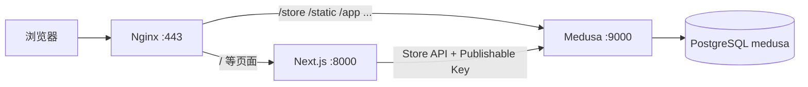

# VPS 生产部署指南（tea.leodennis.top）

本文档记录 **2026-05-18** 在 Vultr VPS 上部署 Zentee 茶叶店（本仓库）的完整流程，供后续更新与排障使用。通用运维原则见 [07-Deployment-Operations](./07-Deployment-Operations.md)。

## 1. 部署概览

| 项目         | 值                                                                  |
| ------------ | ------------------------------------------------------------------- |
| 域名         | `tea.leodennis.top`                                                 |
| 服务器       | `149.28.118.59`（SSH 别名 `server`，用户 `linuxuser`）              |
| 代码目录     | `/home/linuxuser/tea-store`                                         |
| 商店前台     | https://tea.leodennis.top/us/store                                  |
| Medusa Admin | https://tea.leodennis.top/app                                       |
| 进程管理     | PM2：`tea-backend`（9000）、`tea-front`（8000）                     |
| 反向代理     | Nginx + Let's Encrypt                                               |
| 数据库       | 本机 PostgreSQL（Docker 容器 `chatwoot-postgres-1`，库名 `medusa`） |

### 1.1 流量路径



Nginx 将 Medusa 相关路径转发到后端，其余转发到 Next.js，使浏览器可用**同一域名**访问 API 与静态资源（`/static/*`），与前端 `resolveMedusaAssetUrl` 逻辑一致。

## 2. 仓库内相关文件

| 文件                                     | 用途                                          |
| ---------------------------------------- | --------------------------------------------- |
| `ecosystem.config.cjs`                   | PM2 进程定义                                  |
| `scripts/deploy-server.sh`               | 日常拉代码、构建、重启                        |
| `scripts/server-bootstrap.sh`            | 首次装机（建库、seed、nginx 等，仅初次）      |
| `scripts/nginx-tea.leodennis.top.conf`   | Nginx 站点模板                                |
| `front/src/lib/util/medusa-image-url.ts` | 将 `/static/` 资源归一到 `MEDUSA_BACKEND_URL` |

## 3. 服务器前置条件

- **Node.js** ≥ 20（当前 v20.x）
- **pnpm** 9.12.3（建议安装到 `~/.local`：`npm install -g pnpm@9.12.3 --prefix ~/.local`）
- **PM2**、**Nginx**、**Certbot**
- **PostgreSQL** 可访问（本部署复用宿主机 `127.0.0.1:5432` 上已有实例）
- **DNS**：`tea.leodennis.top` A 记录指向 `149.28.118.59`
- **磁盘 / 内存**：该机约 1GB RAM，根分区曾 >90% 占用；在机上完整 `medusa build`（含 Admin 前端）易 **OOM**，见 [§6 低内存构建](#6-低内存构建推荐流程)

## 4. 环境变量（勿提交 Git）

### 4.1 `backend/.env`（仅服务器）

```env
DATABASE_URL=postgres://medusa:<密码>@127.0.0.1:5432/medusa
STORE_CORS=https://tea.leodennis.top,http://tea.leodennis.top
ADMIN_CORS=https://tea.leodennis.top,http://tea.leodennis.top
AUTH_CORS=https://tea.leodennis.top,http://tea.leodennis.top
JWT_SECRET=<随机强密钥>
COOKIE_SECRET=<随机强密钥>
```

首次建库密码可记在服务器 `~/tea-store/.deploy-secrets`（`chmod 600`）。

### 4.2 `front/.env.local`（仅服务器）

```env
MEDUSA_BACKEND_URL=https://tea.leodennis.top
NEXT_PUBLIC_MEDUSA_PUBLISHABLE_KEY=pk_xxxxxxxx
```

- **`MEDUSA_BACKEND_URL`**：Next 服务端 / 中间件请求 Medusa 的地址；生产使用 HTTPS 公网域名。
- **`NEXT_PUBLIC_MEDUSA_PUBLISHABLE_KEY`**：商店 Store API 凭证，见 [08-Multiple-API-Keys-Guide](./08-Multiple-API-Keys-Guide.md)。  
  执行 `pnpm run seed` 后终端会打印 `pk_...`，须同步到本文件并 `pm2 restart tea-front --update-env`。

### 4.3 本机 `/etc/hosts`（可选）

在服务器上可增加，便于在未配 HTTPS 前用域名访问本机 Nginx：

```text
127.0.0.1 tea.leodennis.top
```

## 5. 首次部署

### 5.1 克隆与依赖

```bash
ssh server
export PATH="$HOME/.local/bin:$PATH"
git clone https://github.com/tianyehedashu/tea-store.git ~/tea-store
cd ~/tea-store
pnpm install --frozen-lockfile
```

### 5.2 数据库

在已有 PostgreSQL 上创建用户与库（示例，密码请自行生成）：

```bash
docker exec chatwoot-postgres-1 psql -U postgres -c \
  "CREATE USER medusa WITH PASSWORD '你的密码';"
docker exec chatwoot-postgres-1 psql -U postgres -c \
  "CREATE DATABASE medusa OWNER medusa;"
```

写入 `backend/.env` 后：

```bash
cd ~/tea-store/backend
pnpm exec medusa db:migrate
pnpm run seed
# 记录输出的 NEXT_PUBLIC_MEDUSA_PUBLISHABLE_KEY
pnpm exec medusa user --email admin@zentee.com --password '你的强密码'
```

### 5.3 构建与 Admin 静态目录

Medusa 生产启动会在 **`backend/public/admin`** 查找 Admin 的 `index.html`（构建产物在 `.medusa/server/public/admin`）。构建后需复制：

```bash
cd ~/tea-store/backend
pnpm run build   # 若 OOM，见 §6
mkdir -p public
rm -rf public/admin
cp -a .medusa/server/public/admin public/admin
```

### 5.4 前端构建

```bash
cd ~/tea-store/front
# 先写好 .env.local
pnpm run build
```

### 5.5 PM2

```bash
cd ~/tea-store
pm2 start ecosystem.config.cjs
pm2 save
sudo env PATH=$PATH:/usr/bin pm2 startup systemd -u linuxuser --hp /home/linuxuser
```

### 5.6 Nginx 与 HTTPS

```bash
sudo mkdir -p /var/www/ssl-proof/tea
sudo cp ~/tea-store/scripts/nginx-tea.leodennis.top.conf \
  /etc/nginx/sites-enabled/tea.leodennis.top.conf
sudo nginx -t && sudo systemctl reload nginx
sudo certbot --nginx -d tea.leodennis.top
```

证书续期：`sudo certbot renew`（通常已配 cron）。

## 6. 低内存构建（推荐流程）

在 **~1GB RAM** 的 VPS 上，`medusa build` 编译 Admin 前端时可能 **JavaScript heap out of memory**。

**推荐**：在开发机（内存充足）构建后上传：

```bash
# 开发机（仓库 backend 目录）
pnpm run build
tar -czf medusa-server.tgz -C .medusa server
scp medusa-server.tgz server:~/medusa-server.tgz

# 服务器
mkdir -p ~/tea-store/backend/.medusa
tar -xzf ~/medusa-server.tgz -C ~/tea-store/backend/.medusa
mkdir -p ~/tea-store/backend/public
rm -rf ~/tea-store/backend/public/admin
cp -a ~/tea-store/backend/.medusa/server/public/admin \
      ~/tea-store/backend/public/admin
```

前端可在服务器构建（`MEDUSA_BACKEND_URL` 指向已运行的 `http://127.0.0.1:9000` 或经 Nginx 的 `http://tea.leodennis.top`），内存占用通常低于 Medusa Admin 构建。

## 7. 日常更新

```bash
ssh server
cd ~/tea-store
git pull origin master
export PATH="$HOME/.local/bin:$PATH"
bash scripts/deploy-server.sh
```

或手动：

```bash
pnpm install --frozen-lockfile
# backend：build + 复制 public/admin（§5.3）
# front：build
pm2 restart tea-backend tea-front --update-env
```

## 8. 运维命令速查

```bash
# 状态
pm2 status
pm2 logs tea-backend --lines 50
pm2 logs tea-front --lines 50

# 健康检查
curl -s https://tea.leodennis.top/health
curl -s -H "x-publishable-api-key: $PK" https://tea.leodennis.top/store/regions | head

# Nginx
sudo nginx -t && sudo systemctl reload nginx
```

## 9. 常见问题

### 9.1 `Could not find index.html in the admin build directory`

未执行 §5.3 的 `public/admin` 复制。复制后 `pm2 restart tea-backend`。

### 9.2 前台 500 / TLS 证书错误

`front/.env.local` 中 `MEDUSA_BACKEND_URL` 使用了尚未签发证书的 `https://...`，或域名解析到错误证书。应先 HTTP + hosts 验证，再 `certbot`，最后改为 `https://tea.leodennis.top`。

### 9.3 商品图不显示 / 列表图与详情不一致

确认 `MEDUSA_BACKEND_URL` 与浏览器访问域名一致；种子数据里可能是 `localhost` URL，由 `resolveMedusaAssetUrl` 重写。`front/next.config.js` 的 `images.remotePatterns` 需包含生产域名。

### 9.4 中间件报 regions not found

- 后端未启动或 Publishable Key 错误
- 检查 `NEXT_PUBLIC_MEDUSA_PUBLISHABLE_KEY` 与 seed 输出是否一致

### 9.5 磁盘不足

根分区占用过高会导致 `pnpm install` / 构建失败。清理 Docker 镜像、日志、旧备份后再部署。

## 10. 安全说明

- **不要**将 `backend/.env`、`front/.env.local`、`.deploy-secrets` 提交到 Git。
- **Publishable Key**（`pk_`）可暴露在前端；**JWT_SECRET / COOKIE_SECRET / 数据库密码** 仅服务端。
- 生产环境请修改默认管理员密码；按需配置 Redis（当前为内存 Event Bus，不适合多实例）。

## 11. 变更记录

| 日期       | 说明                                                      |
| ---------- | --------------------------------------------------------- |
| 2026-05-18 | 首次部署至 `tea.leodennis.top`；提交 `83dc50d`、`4bf5abe` |
